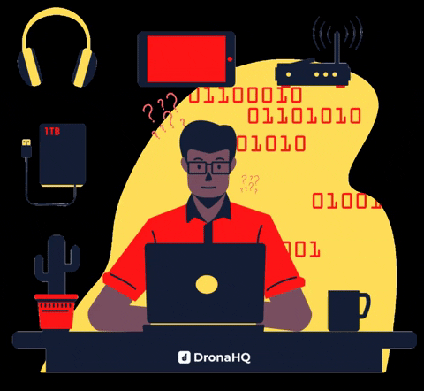

#  🤓 Seja bem vindos. Fique à vontade!!! 
Olá aqui você vai encontrar alguns tipos de projetos feitos por meio de desafios e projetos pessoais.

- 🧑‍💻 estudando Front-End
- 🤓 Cursando Ciência da computação
- 🐢 

  &nbsp;
  &nbsp;
  &nbsp;
  &nbsp;

---

  

